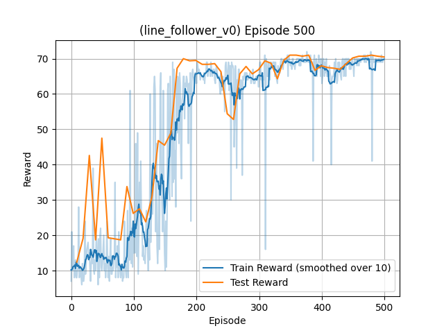

# Line Follower v0 — DQN Training

This folder contains the training, evaluation, and manual play scripts for the Line Follower v0 task. It uses the custom environment described here:

- Environment README: [../gym_envs/line_follower_v0](../gym_envs/line_follower_v0)
- Env ID: `my_gym_envs/line_follower_v0`

## Algorithm

- Deep Q-Network (DQN) with:
  - Experience Replay (uniform sampling)
  - Target Network updated every N episodes (`TARGET_UPDATE`)
  - Epsilon-greedy exploration with exponential decay
- Q-network: small MLP (state_dim -> 32 -> action_dim=3) with ReLU in between.
- Action space: Discrete(3) [turn right, go straight, turn left]
- Observation: Flattened binary sensor grid (default `(4,6)` = 24 bits)

## How Training Works

- Script: `main.py`
- Key settings (see the script for full details):
  - Episodes: `EPISODES = 500`
  - Gamma: `GAMMA = 0.9`
  - Learning rate: `LR = 1e-4`
  - Batch size: `BATCH_SIZE = 64`
  - Replay memory: `MEMORY_SIZE = 5000`
  - Target update every `TARGET_UPDATE = 10` episodes
  - Epsilon decay: `EPS_DECAY = (EPS_END/EPS_START) ** (1/(0.7*EPISODES))`
  - Env params: `sensor_grid=(4,6)`, `track="rounded_square"`, `max_steps=200`, `hitbox=40`
- Checkpointing and evaluation:
  - Saves checkpoints to `dqn_linefollower.pth`
  - Evaluates every target update via `evalualte.evaluate_model` and appends to a test curve
  - Plots smoothed training rewards and test rewards to `rewards_plot.png`

## How to Run

Assuming you have followed the installation instructions in the [root README](../) and the relevant environment is activated.

Train:

```bash
python main.py
```

Evaluate (without training):

- Requires `dqn_linefollower.pth` (already provided in this folder). You can run evaluation directly.

```bash
python evalualte.py
```

Manual Play (keyboard):

- Use `test.py` to drive the car:
  - Left/Right arrow keys to steer
  - `enable_assist = True` provides a very basic assist using edge sensors

```bash
python test.py
```

## Results

- Trained model: `dqn_linefollower.pth`
- Training and test rewards over episodes:

<p align="center">
  
</p>

## Files

- `main.py`: DQN training loop, checkpointing, plotting.
- `evalualte.py`: Evaluate a saved checkpoint on the environment.
- `test.py`: Manual play with keyboard controls (optional assist).
- `dqn_linefollower.pth`: Saved model checkpoint (created/updated by training; one is included here).
- `rewards_plot.png`: Reward curves generated during training.
