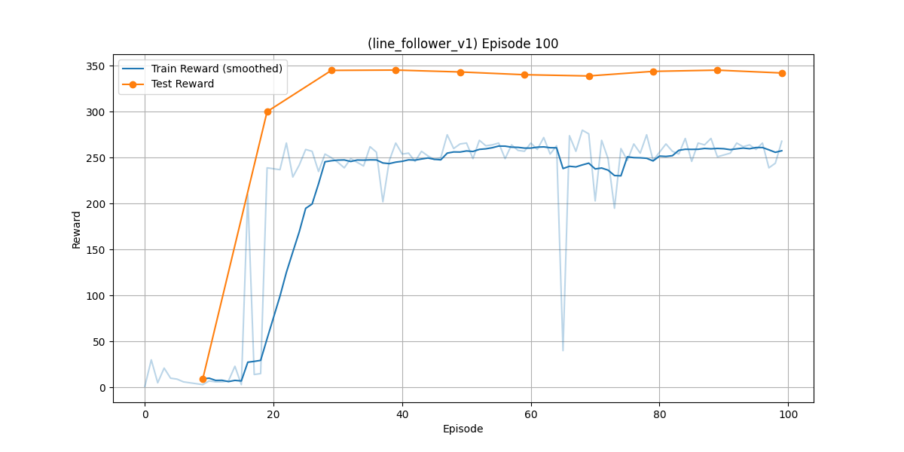

# Line Follower v1 — DDPG Training

This folder contains the training and evaluation scripts for the Line Follower v1 task, which uses continuous actions. It builds on the custom environment described here:

- Environment README: [../gym_envs/line_follower_v1](../gym_envs/line_follower_v1)
- Env ID: `my_gym_envs/line_follower_v1`

## Why Actor-Critic?

In the previous version (Line Follower v0), we used DQN, a purely value-based approach where the model learns to predict Q-values for state-action pairs. This works well for discrete actions but can struggle with continuous action spaces due to the need to approximate Q-values over a large action space.

For v1, the action space is continuous (wheel speeds in [-5, 5]), so we switched to an actor-critic method: Deep Deterministic Policy Gradient (DDPG). Actor-critic is a hybrid of value-based and policy-based approaches. Instead of predicting Q-values for all possible actions, we split the problem:

- The **Actor** network directly outputs the best action (policy) for a given state.
- The **Critic** network evaluates how good that action is by predicting the Q-value (value) for the state-action pair.

This allows handling continuous actions more efficiently, with the actor learning the policy and the critic providing feedback. DDPG uses experience replay, target networks, and soft updates for stability, plus noise for exploration. It's like having a "driver" (actor) and a "coach" (critic) working together.

## Algorithm

- Deep Deterministic Policy Gradient (DDPG) with:
  - Actor network: MLP (state_dim → 32 → 32 → action_dim) with ReLU and Tanh (outputs actions in [-5, 5])
  - Critic network: MLP (state_dim + action_dim → 32 → 32 → 1) with ReLU
  - Experience Replay (uniform sampling)
  - Target Networks with soft updates (τ = 0.001)
  - Exploration via Gaussian noise added to actions
- Action space: Box(low=-5.0, high=5.0, shape=(2,)) [left wheel speed, right wheel speed]
- Observation: Flattened binary sensor grid (default `(4,6)` = 24 bits)

## How Training Works

- Script: `main.py`
- Key settings (see the script for full details):
  - Episodes: `EPISODES = 100`
  - Gamma: `GAMMA = 0.99`
  - Actor LR: `LR_ACTOR = 1e-4`
  - Critic LR: `LR_CRITIC = 1e-3`
  - Batch size: `BATCH_SIZE = 64`
  - Replay memory: `MEMORY_SIZE = 5000`
  - Noise stddev: `NOISE_STDDEV = 0.5`
  - Soft update τ: `TAU = 1e-3`
  - Env params: `sensor_grid=(4,6)`, `track="rounded_square"`, `max_steps=200`, `hitbox=30`
- Checkpointing and evaluation:
  - Saves checkpoints to `ddpg_linefollower_v1.pth`
  - Evaluates every 10 episodes via `evaluate.evaluate_model` and appends to a test curve
  - Plots smoothed training rewards and test rewards to `rewards_plot_v1.png`

## How to Run

Assuming you have followed the installation instructions in the [root README](../) and the relevant environment is activated.

Train:

```bash
python main.py
```

Evaluate (without training):

- Requires `ddpg_linefollower_v1.pth` (already provided in this folder). You can run evaluation directly.

```bash
python evaluate.py
```

## Results

- Trained model: `ddpg_linefollower_v1.pth`
- Training and test rewards over episodes:

<p align="center">
  
</p>

## Files

- `main.py`: DDPG training loop, checkpointing, plotting.
- `evaluate.py`: Evaluate a saved checkpoint on the environment.
- `ddpg_linefollower_v1.pth`: Saved model checkpoint (created/updated by training; one is included here).
- `rewards_plot_v1.png`: Reward curves generated during training.