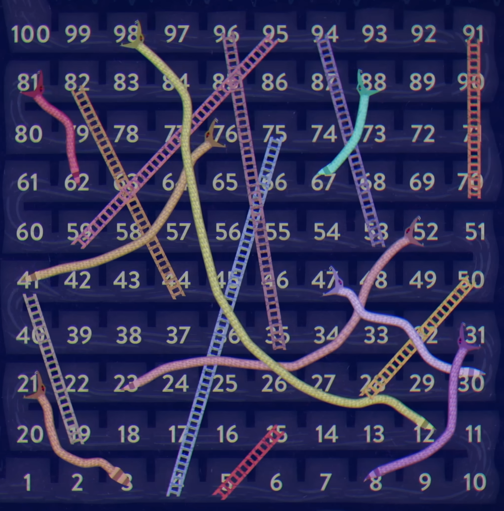

# Snake and Ladder with a Magical Dice — Q-Learning

This was my first reinforcement learning simulation. I learned the most basic Q-table approach and used it to solve a fun twist on Snake and Ladder: the player has a “magical dice” and can precisely choose the outcome (1–6) each turn. The goal is to finish the game in the fewest possible moves.

I got the idea from this video (highly recommended; starts at 59s):

> [Can you cheat death by solving this riddle? - Shravan S K](https://youtu.be/N3JL3z4e2Qs?t=59)

And here’s the board layout I followed:

<p align="center">
  
</p>

## Game

- Classic Snake and Ladder board (cells 1–100) with standard snakes and ladders as shown in the layout.
- On each turn, the agent can choose any die outcome from 1 to 6 (the “magical dice”).
- Objective: reach the final cell in the minimum number of turns.

A reward function I designed back then (and kept!) to shape the behavior:

```python
def reward(turns, reward_origin = 10, max_steps = 15):
    return reward_origin - turns if turns < max_steps else -max_steps
```

This encourages finishing in fewer turns (higher reward when turns are small) and caps the penalty for very long paths.

A key insight from the video (and verified by this setup):

- If you only use ladders, the shortest paths are 6 steps.
- Counterintuitively, if you also allow using snakes strategically, you can finish in just 5 steps.

But I have seen that that the agent is being able to discover the 5 step paths, but not staying at those... maybe I would need to restructure the reward function to give some very high rewards for achieving the 5 step paths. We will do that some day.

## Files

- `snake_ladder.py`: The environment code.
- `manual.ipynb`: Jupyter notebook for manual exploration.
- `play.ipynb`: Notebook to train / simulate optimal play.
- `layout.png`: Board layout image.