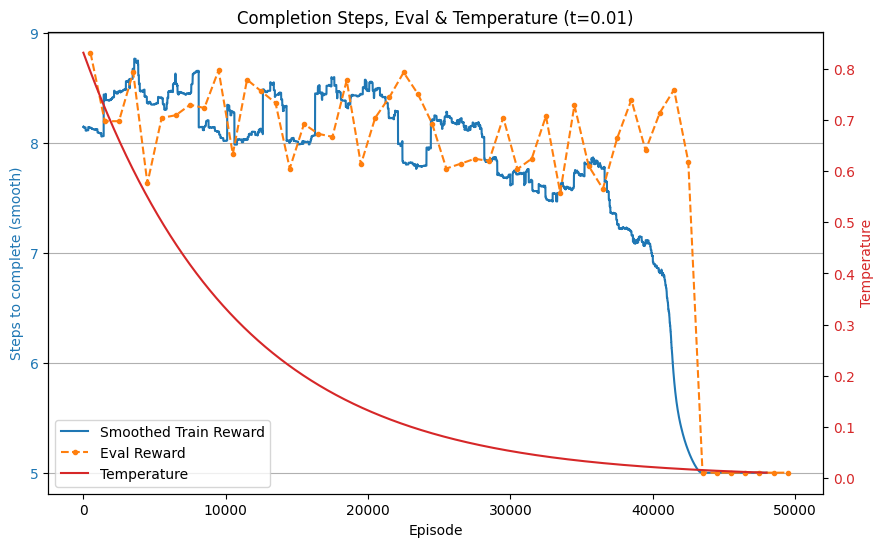
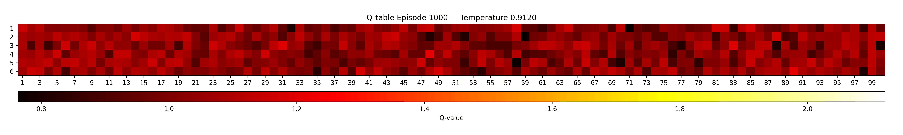

# Snake and Ladder — Revisit (Exponential Reward + Softmax Exploration)

This is the second iteration of our “magical dice” Snake & Ladder experiment. In the first version (see `../snake_ladder`) the agent often settled for 6‑ or 7‑step solutions instead of consistently finding (and sticking to) the optimal 5‑step paths. The core issue: a linear reward made a 5‑step win only slightly better than a 6‑step win. Here we reshape the reward and change exploration so the shortest path is overwhelmingly preferred.

We train against the new packaged environment ([`../gym_envs/snake_ladder`](../gym_envs/snake_ladder), README) which exposes a Gym interface (`my_gym_envs/snake_ladder_v0`).

## Motivation in One Picture

Old idea: linear reward... results in the “small enough paths are fine" behaviour.

New idea: exponential reward

$$
\text{reward} = 10^{5 - \text{turns}}
$$

Now every step saved returns 10 times more reward (5 steps give 1, 6 steps give 0.1, 7 steps give 0.01 and so on). That huge gap forces the policy to converge on the genuine shortest solutions instead of hovering near‑optimal.

## What Changed

| Aspect | Previous Version | Revisit |
| ------ | ---------------- | ------- |
| Reward | Linear (add/subtract per turn) | Exponential (10× per step saved) |
| Exploration | Epsilon‑greedy | Temperature softmax (Boltzmann) with decay |
| Consistency on 5‑step paths | Unstable | Strongly reinforced |
| Visualization | Basic plots | Adds animated Q‑table evolution GIF |

We deliberately keep implementation simple: still plain tabular Q‑learning.

## Algorithm

- Tabular Q‑learning.
- Action selection: $\pi(a|s) = \frac{\exp(Q(s,a)/T)}{\sum_{a'} \exp(Q(s,a')/T)}$. Temperature decays from `TEMP_START` to `TEMP_END` geometrically each episode.
- Update (per step):
  - $\text{target} = \text{reward} + \gamma \cdot \max_{a'} Q(s', a')$
  - $Q(s,a) \leftarrow Q(s,a) + \alpha \cdot (\text{target} - Q(s,a))$
- While evaluation we go greedy mode with temperature $\approx 0$ every 1000 episodes.


## Running

Assuming dependencies are installed and the relant virtual environment are activated (see the [root README](../README.md)):

```bash
python main.py
```

## Results

Training / evaluation curve:

<p align="center">
  
</p>

Q‑table evolution:



## Files

- [`main.py`](main.py) — training loop, exponential reward usage, temperature softmax, plotting & GIF.
- [`utils.py`](utils.py) — QTable wrapper and evaluation helper.
- [`reward_graph.png`](reward_graph.png) — generated performance plot.
- [`q_table_evolution.gif`](q_table_evolution.gif) — animated Q‑table progression (generated at end of training).
